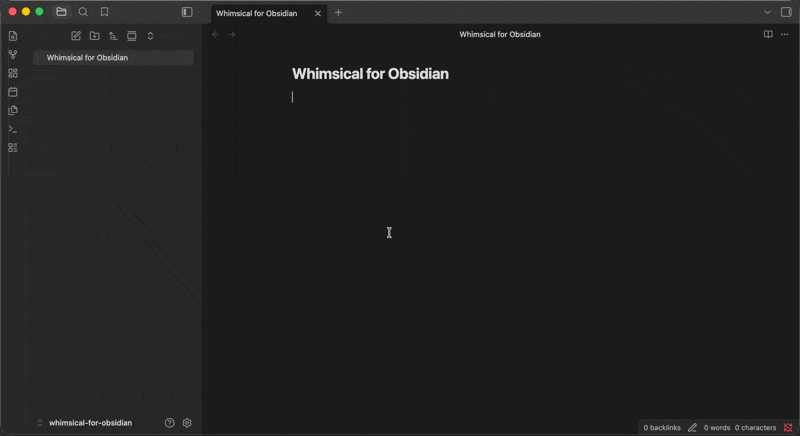

# 🟣 Whimsical for Obsidian

Embed live [Whimsical](https://whimsical.com) boards in your Obsidian notes.
Put a Whimsical link on its own line, switch to Reading view, and the board
renders inline.



## 🚀 Features

- 🖼️ **Live boards in your notes** – pan, zoom, and explore without leaving
  Obsidian.
- 🔗 **Just paste a link** – no setup, no special syntax: the link becomes
  the board.
- 🌍 **Public and private boards** – public boards show up instantly;
  private boards ask you to sign in to Whimsical first, right inside the
  note.

> ⚠️ Boards appear in **Reading view**. In editing view, links stay plain
> links.

## 🖱️ How to Use

Copy a board's link from Whimsical, paste it on its own line in a note, and
switch to Reading view. The link turns into the live board, matching your
light or dark theme.

What works:

- `https://whimsical.com/<some-board-slug>` — ✔️
- `https://www.whimsical.com/<some-board-id>` — ✔️
- `https://whimsical.com/<workspace>/<some-board-slug>` — ✔️
- `https://whimsical.com/templates/affinity-diagram` — ❌ (not a board)
- A link mixed into a sentence with other text — ❌ (stays a plain link)

Links mentioned mid-sentence stay ordinary links on purpose, so your prose
never gets interrupted by a large embed. Links that point at a specific
frame or presentation keep pointing there.

## 🌍 Public vs. private boards

- **Public boards** appear right away — no Whimsical account needed.
- **Private boards** show Whimsical's sign-in screen inside the note. Sign
  in there and the board appears. The plugin never sees or stores your
  password.

## 📦 Installation Guide

**From Community Plugins:** open Settings → Community
plugins → Browse, search for "Whimsical", and install.

**Manual installation:** download the three files from the
[latest GitHub release](../../releases/latest) and place them in your vault
like this:

> ```
> <vault>/
> └── .obsidian/
>     └── plugins/
>         └── whimsical/
>             ├── main.js
>             ├── manifest.json
>             └── styles.css
> ```

Then enable the plugin from Settings → Community plugins.

## 🛠️ Development

> ⚠️ Develop and test this plugin in a **dedicated test vault** — never in a
> vault you rely on for real notes. Obsidian's own developer documentation
> warns against developing plugins in a primary vault, since a broken build
> or a bug in early-stage code can affect the vault it's loaded into.

### Build and test commands

```bash
npm ci           # install exact dependency versions
npm run dev       # esbuild watch build for local development
npm run lint      # eslint
npm test          # vitest
npm run typecheck # tsc --noEmit
npm run build     # typecheck + production esbuild build
npm run check     # lint + test + build (what CI runs)
npm run audit     # dependency audit (see policy below)
```

### Release assets

A release consists of exactly three files, matching what Obsidian's plugin
loader expects in a plugin's folder: `main.js`, `manifest.json`, and
`styles.css`. These are attached to each GitHub release tagged with the
plugin's semantic version (e.g. `1.0.0`).

### Audit policy

`npm run audit` runs two checks and both must pass in CI:

1. `npm audit --omit=dev` — every advisory affecting runtime (production)
   dependencies blocks CI, at any severity.
2. `npm audit --audit-level=high` — every high or critical advisory
   anywhere in the full dependency tree (including dev-only dependencies)
   blocks CI.

Lower-severity advisories that affect **only** dev-only (build/test-time)
dependencies do not block CI on their own — they remain visible in
`npm audit` output, but the project may temporarily accept them while an
exact compatible upgrade is pursued, provided the dependency path and the
rationale for accepting the risk are documented in the pull request that
introduces or observes it. Runtime-affecting or high/critical advisories
are never accepted this way — they must be fixed before merging.

## 📄 License

This plugin is released under the [MIT License](LICENSE).
